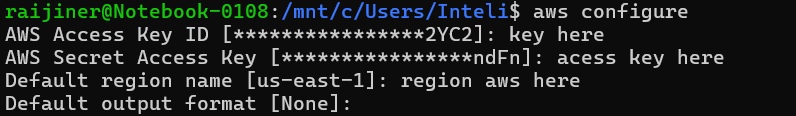
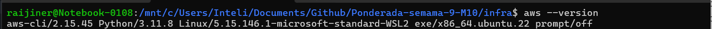
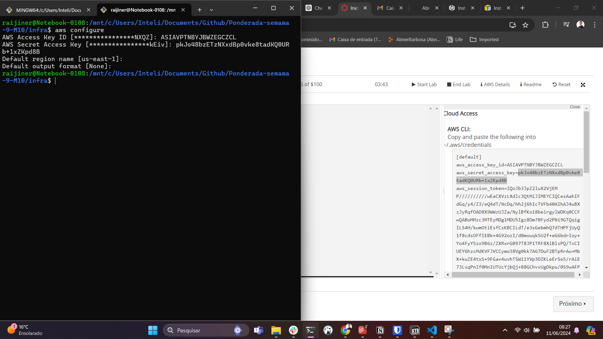
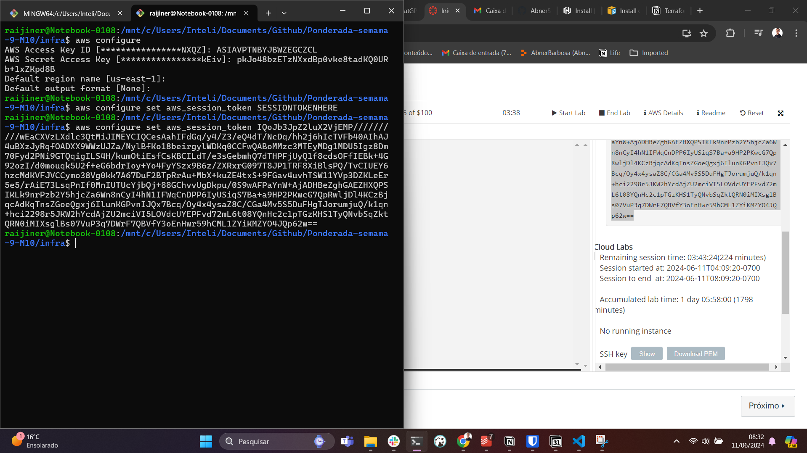
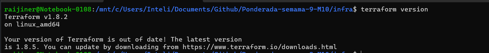
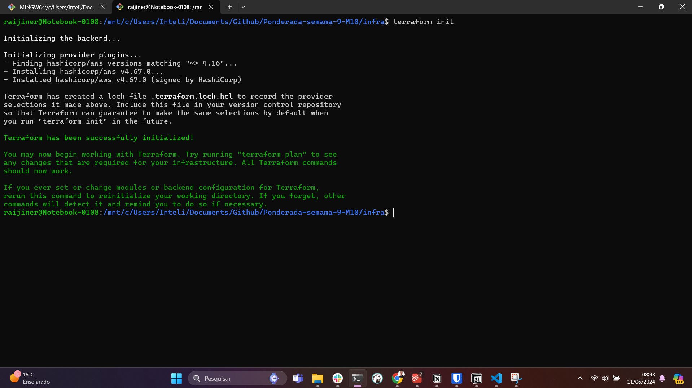
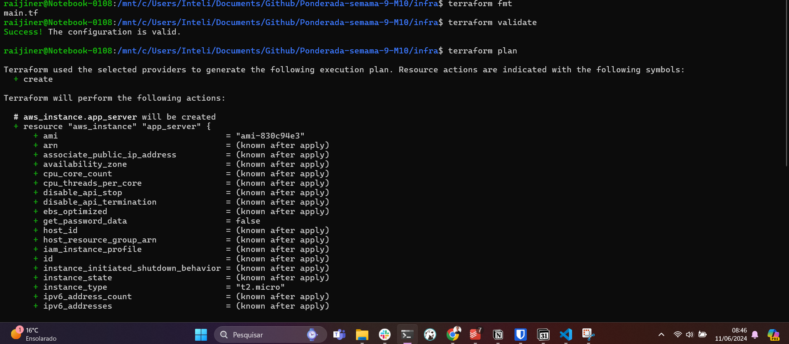
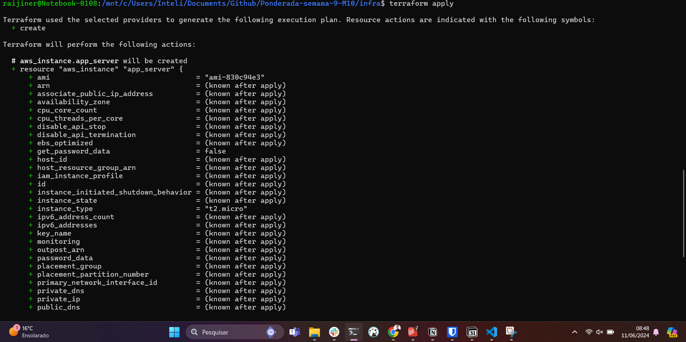
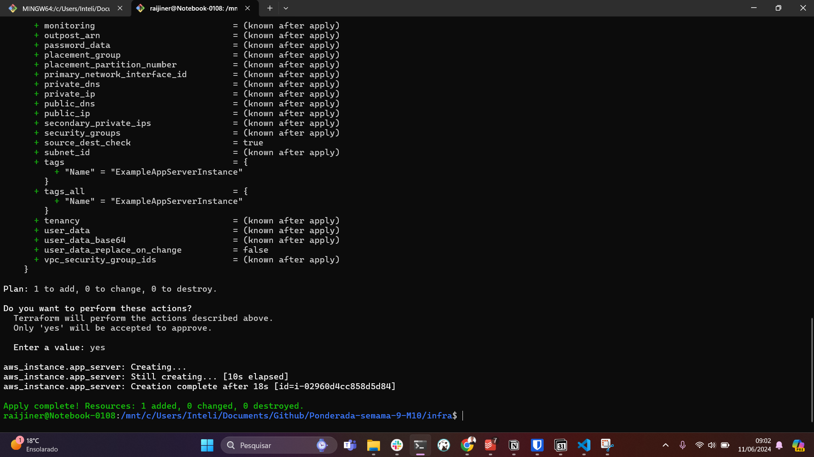
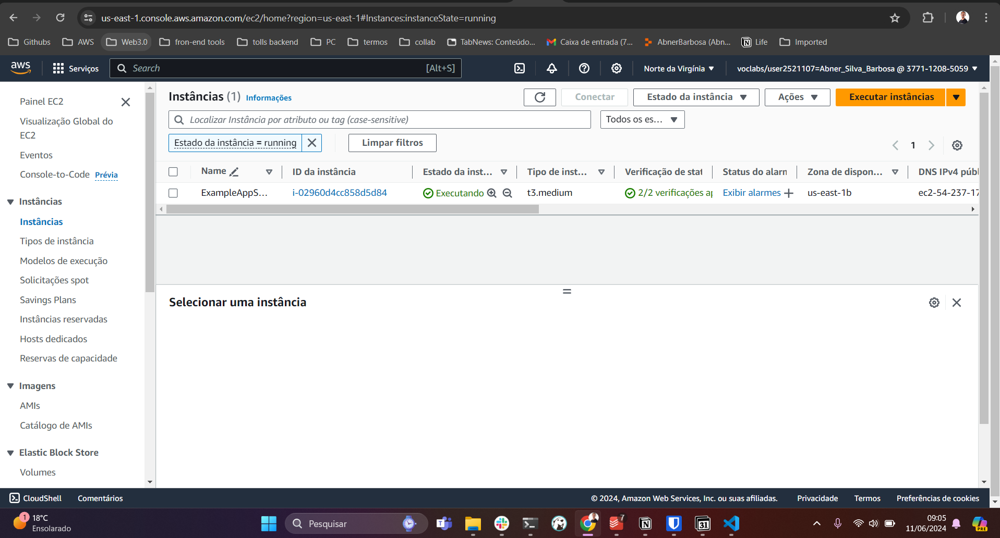

## O que é o Terraform

O Terraform é uma ferramenta de infraestrutura como código (IaC) que permite aos desenvolvedores e administradores de sistemas definir, provisionar e gerenciar recursos de infraestrutura de uma maneira declarativa e eficiente. 

**Código localizado na pasta infra do projeto**

## Passo a Passo de como utilizar

### Instalar a CLI do Terraform

[Install | Terraform | HashiCorp Developer](https://developer.hashicorp.com/terraform/install)

**Verificar se deu tudo certo na instalação, executar o código abaixo no terminal do computador:**

```bash
terraform version
# outinput: Terraform vX.XX.x
```

<br>

### Instalar a CLI da AWS

[Install or update to the latest version of the AWS CLI - AWS Command Line Interface](https://docs.aws.amazon.com/cli/latest/userguide/getting-started-install.html)

**Verificar se deu tudo certo na instalação, executar o código abaixo no terminal do computador:**

```bash
aws --version
# outinput: aws-cli/2.15.45 Python/3.11.8 ...
```

<br>

**Após instalar a CLI da AWS, é necessário colocar as credências da conta da AWS com o seguintes comandos abaixo, também vai estar a lista das credênciais:**

- aws_access_key_id
- aws_secret_access_key
- aws_session_token

```bash
aws configure
```



```bash
aws configure set aws_session_token SESSIONTOKENHERE
```
<br>

### Executando código do Terraform

**Após realizar todas as configurações acima, você deve acessar a pasta infra do projeto e logo em seguida executar os seguintes comandos no terminal:**

<p><span style="color: purple;">terraform init</span>: Este comando é usado para inicializar um diretório de trabalho do Terraform. Ele é geralmente executado no início de um novo projeto ou quando o diretório do projeto é atualizado com novos plugins ou módulos. Durante a inicialização, o Terraform baixa os plugins necessários para a configuração do provedor (por exemplo, AWS, Azure, Google Cloud, etc.) e estabelece uma conexão com o backend de armazenamento de estado, se aplicável.</p>

```bash
terraform init
```

<br>

<p><span style="color: purple;">terraform fmt</span>: Este comando é usado para formatar o código do Terraform de acordo com as convenções de estilo recomendadas pelo Terraform. Ele ajusta a indentação, espaçamento e formatação geral do código para torná-lo mais legível e consistente. Executar terraform fmt ajuda a manter um estilo de código uniforme em um projeto e facilita a colaboração entre membros da equipe.

```bash
terraform fmt
```
<br>


<p><span style="color: purple;">terraform validate</span>: Este comando é usado para validar a sintaxe e a semântica do código do Terraform. Ele verifica se o código está correto em termos de estrutura e configuração. Durante a validação, o Terraform analisa os arquivos de configuração e identifica quaisquer erros ou avisos, como referências a recursos inexistentes ou configurações inválidas.

```bash
terraform validate
```

<br>

<p><span style="color: purple;">terraform plan</span>: Este comando é usado para criar um plano de execução do Terraform. Ele examina o código do Terraform e determina quais mudanças serão feitas na infraestrutura quando o comando terraform apply for executado. O plano mostra uma visão geral das adições, atualizações e remoções de recursos que ocorrerão, permitindo que você revise e confirme as mudanças antes que sejam aplicadas.

```bash
terraform plan
```

<br>


<p><span style="color: purple;">terraform apply</span>: Este comando é usado para aplicar as mudanças planejadas à infraestrutura. Quando executado, o Terraform verifica o plano de execução gerado pelo comando terraform plan e solicita confirmação para aplicar as mudanças. Depois de confirmado, o Terraform faz as alterações na infraestrutura de acordo com o plano e atualiza o estado do projeto para refletir as mudanças realizadas.

```bash
terraform apply
```
<br>

### Evidencias da execução do código





<br>







<br>

