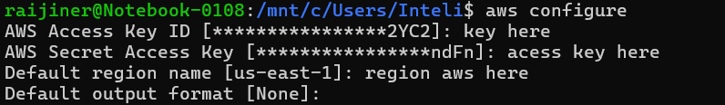

## Passo a Passo das configurações ⛷️

Aqui você escontrara links e comandos para verificar se as instalações na maquina foram instalados de forma correta.

Para facilitar a sua vida como desenvolvedor e pessoa, recomendo a utilização do WSL, utilizando o linux para instalar a cli do terraform e da aws, onde você também vai executar os comandos pelo WSL.

Sistemas recomendados:
<li>Linux 🐧</li>
<li>MacOs 🍎</li>

### Instalar a CLI do Terraform

[Install | Terraform | HashiCorp Developer](https://developer.hashicorp.com/terraform/install)

**Verificar se deu tudo certo na instalação, executar o código abaixo no terminal do computador:**

```bash
terraform version
# outinput: Terraform vX.XX.x
```

<br>

### Instalar a CLI da AWS

[Install or update to the latest version of the AWS CLI - AWS Command Line Interface](https://docs.aws.amazon.com/cli/latest/userguide/getting-started-install.html)

**Verificar se deu tudo certo na instalação, executar o código abaixo no terminal do computador:**

```bash
aws --version
# outinput: aws-cli/2.15.45 Python/3.11.8 ...
```

<br>

# Configurar as credências da sua conta da AWS ⚒️

**Após instalar a CLI da AWS, é necessário colocar as credências da conta da AWS com o seguintes comandos abaixo, também vai estar a lista das credênciais:**

- aws_access_key_id
- aws_secret_access_key
- aws_session_token

```bash
aws configure
```



```bash
aws configure set aws_session_token SESSIONTOKENHERE
```
<br>

Agora você pode navegar pela parte dos comandos do terraform, tendo a explicação de cada um deles 🟪

[Comandos do terraform e seus objetivos](./terraform.md)