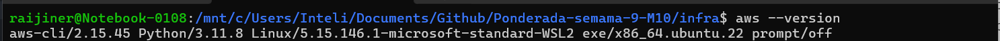
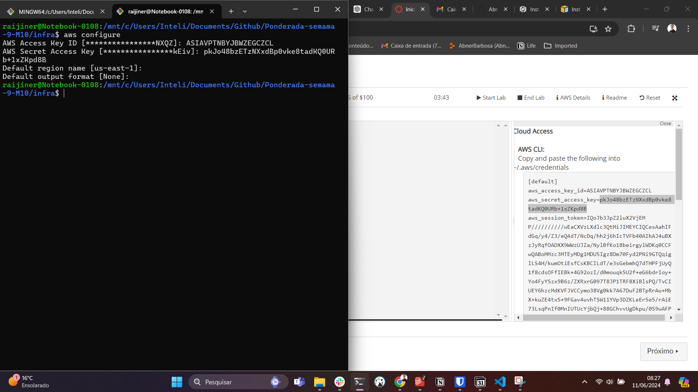
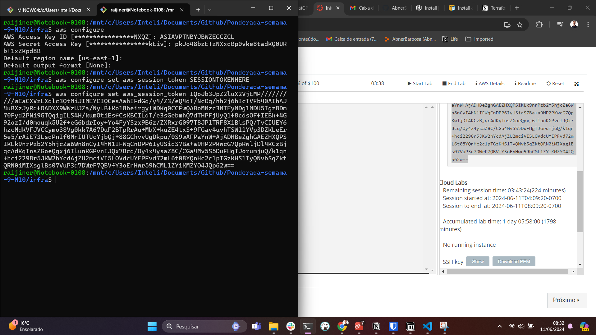
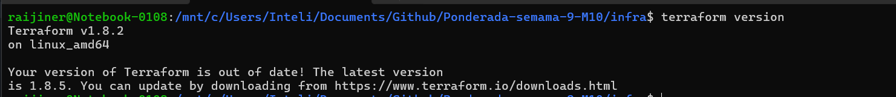
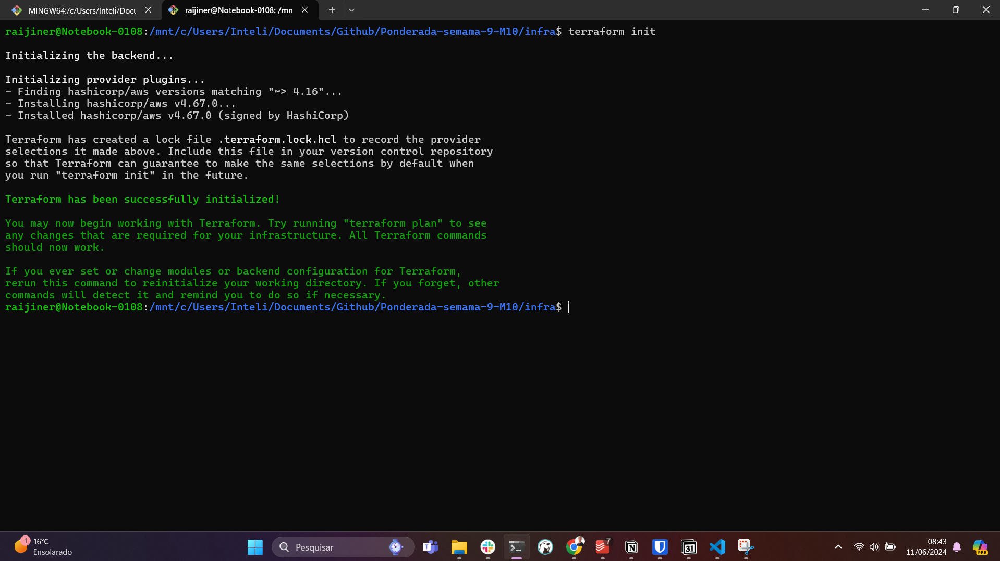
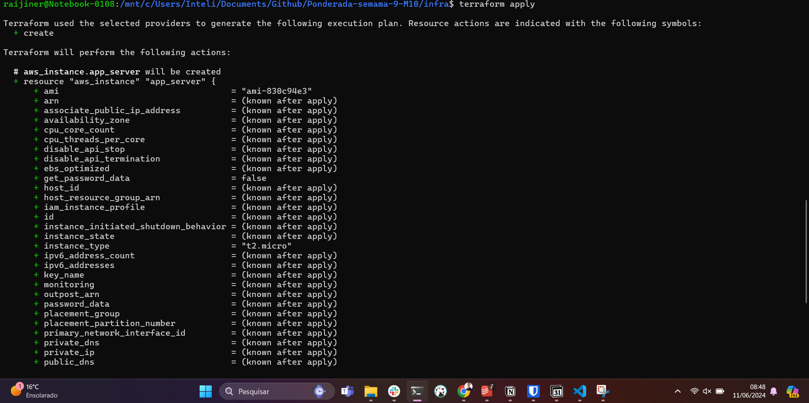
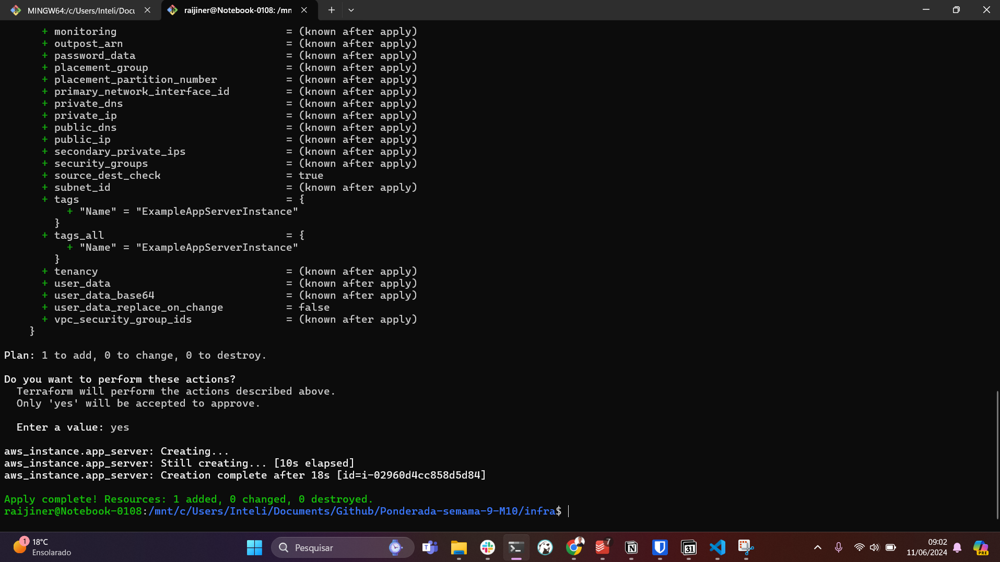
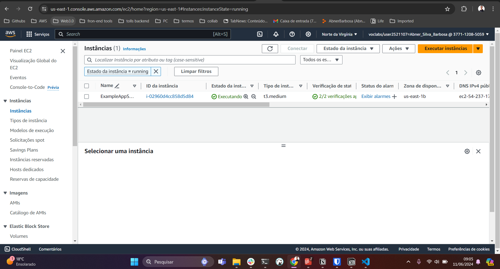

## Evidencias da execução do código 🦆

 

### Configurando as credências da aws academy 😶 

 

### Executando coandos do terraform 😶

 

### Dashboard da aws com a ec2 criada pelo terraform 😶

